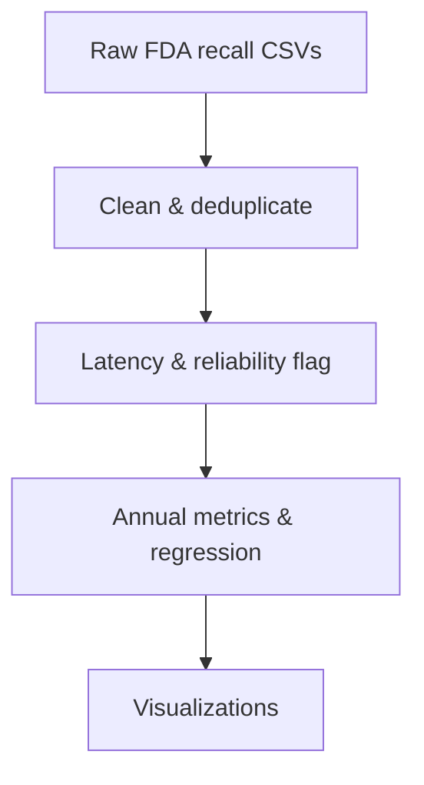

# FDA Class I Drug Recall Analysis (2013–2026) — Classification Latency & Backlog Analysis

## Project Overview
This pipeline investigates whether the FDA's drug recall classification process is slowing down, speeding up, or holding steady over time. It uses publicly available Class I drug recall records pulled from the FDA Data Dashboard, combined across three raw exports covering January 2013 through July 12, 2026.

The core investigation centers on a specific macro-metric: **does the time elapsed between a firm initiating a recall and the FDA Center formally classifying it (Recall Initiation Date → Center Classification Date) show a meaningful trend over time, and is that trend actually driven by recall volume, or is it just calendar drift?**

## Pipeline Flow

---

## Project Structural Architecture

| Goal (Why) | Means (How) | Characteristics (What) | Target Data (Where) | Workflow (When) | Roles (Who) |
| :--- | :--- | :--- | :--- | :--- | :--- |
| **Investigate backlog trend:** Determine whether classification latency is trending up, down, or flat across the full 2013–2026 window. | **Automated pipeline:** CSV ingestion, date parsing, deduplication, and a right-censoring correction before any metric is computed. | **Class I drug recalls only:** Most severe recall tier, filtered from the combined FDA export. | **FDA Data Dashboard:** Three raw CSV extracts spanning Jan 2013 to July 12, 2026. | **Post-ingestion gate:** Latency and reliability flags are computed before annual aggregation. | **Data Scientist / Analyst:** Single-investigator, end-to-end extraction through visualization. |
| **Test the volume-backlog relationship:** Determine whether backlog length is actually explained by concurrent recall volume, or just tracks the calendar year. | **Concurrent-volume windowing:** 45-day rolling count of open cases around each event, tested via raw correlation and a year-controlled OLS regression. | **Detrended comparison:** Both variables have year effects removed via group-mean subtraction before the relationship is visualized. | **Deduplicated event-level dataset:** One row per unique Event ID, with a computed Concurrent_Volume field. | **Final analytical stage:** Runs after annual metrics, immediately before the last visualization layer. | **Data Scientist / Analyst:** Same single-investigator scope. |

---

## Pipeline Architecture

### Section 1 — Environment Setup
* Installs and imports `pandas`, `numpy`, `altair`, `statsmodels`, and `vl-convert-python`.
* Defines a shared Lean Six Sigma color palette (blue, grey, amber, red, dark) so color carries the same meaning in every chart in the notebook: blue for neutral process data, grey for volume/context, amber for a warning zone, red reserved strictly for confirmed threshold breaches.

### Section 2 — Data Loading & Deduplication
* Reads three raw CSV exports (Jan 2013–Dec 2018, Jan 2019–Dec 2023, Jan 2024–July 12 2026), concatenates them, and exports the combined raw file.
* Parses `Recall Initiation Date` and `Center Classification Date`, dropping anything initiated before January 1, 2013.
* Deduplicates on `Event ID`, since the raw export is logged at the item level. A single recall action can generate multiple rows if it covers several pack sizes or lots. This collapses 1,675 raw rows down to 603 unique events. This is the same way FDA reports their results in the offical dashboards. 

### Section 3 — Latency Metric & Right-Censoring Correction
* Computes `Latency_Days` as the day delta between `Center Classification Date` and `Recall Initiation Date`.
* Computes `Report_Lag` (Report Date minus Recall Initiation Date) and derives a reliability cutoff from its 90th percentile.
* Flags each event `Reliable` if it's old enough to have plausibly resolved by the data pull date (July 12, 2026). Recent, still-open events are excluded from every latency-derived metric so they don't skew results toward artificially fast outcomes. Total recall volume isn't affected by this correction, since a recall is countable the moment it's initiated.

### Section 4 — Annual Metrics
* `total_recall_volume`: unique event count per year, computed on the full dataset.
* `median_latency`, `p90_latency`, `pct_over_60`, `pct_over_90`: computed only on the `Reliable` subset, since all four are latency-derived and would otherwise be biased by unresolved recent cases.

### Section 5 — Queue Depth Time Series
* Builds month-end snapshots counting every event that was open, initiated but not yet classified, at that point in time.
* Gives a rolling view of caseload across the full period, rather than relying on year-end summaries alone.

### Section 6 — Volume-Backlog Relationship Test
* Computes `Concurrent_Volume` via a 45-day rolling window around each event's initiation date, using `searchsorted` for O(n log n) performance.
* Runs a raw correlation and an OLS regression of `Latency_Days` on `Concurrent_Volume`, controlling for `Year` fixed effects.
* Detrends both variables via group-mean subtraction so the relationship can be visualized with calendar-year drift removed.

### Section 7 — Visualization
* Median vs. 90th percentile latency by year (line chart).
* Share of recalls exceeding 60- and 90-day thresholds by year (bar chart).
* Monthly queue depth from 2013 through 2026 (area chart).
* Annual recall volume paired with the latency trend line.
* Concurrent volume vs. detrended latency with a regression overlay (scatter).

---

## Data Source & Known Limitations

* **Domain bounds:** Data is sourced from the FDA Data Dashboard, filtered to Class I drug recalls only, covering January 2013 through the July 12, 2026 pull date. Findings reflect drug-center behavior specifically and do not model recall processing for foods, medical devices, or biologics.
* **Right-censoring:** Rather than ignoring the bias that recent, unresolved recalls introduce into latency metrics, this is explicitly corrected for via the `Reliable` flag and a data-driven cutoff based on report-lag distribution.
* **Metric definition:** `Latency_Days` measures internal administrative processing time between a firm's recall initiation and formal Center classification. It does not measure product removal speed from retail shelves or public communication timing.
* **Regression result:** The concurrent-volume regression did not find a statistically significant relationship between caseload and latency once year effects were controlled for (coefficient p = 0.74, 95% CI spanning zero). The backlog trend visible in the charts appears to track calendar year more than concurrent volume itself.
